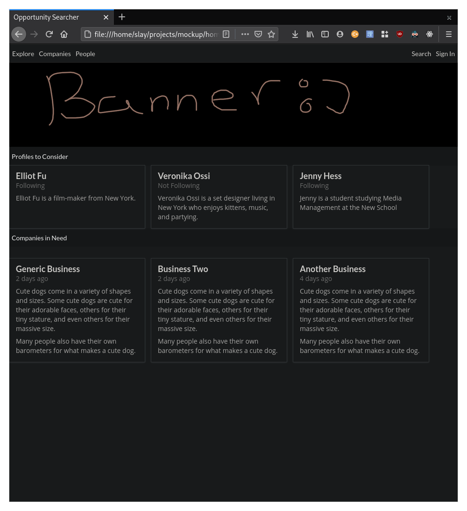
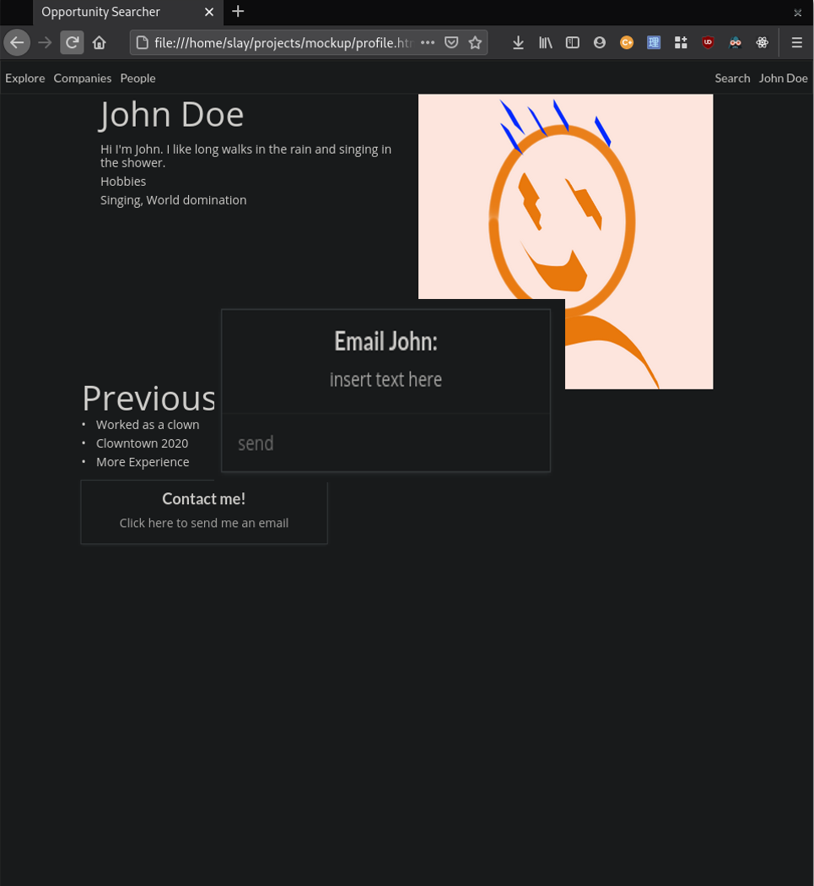
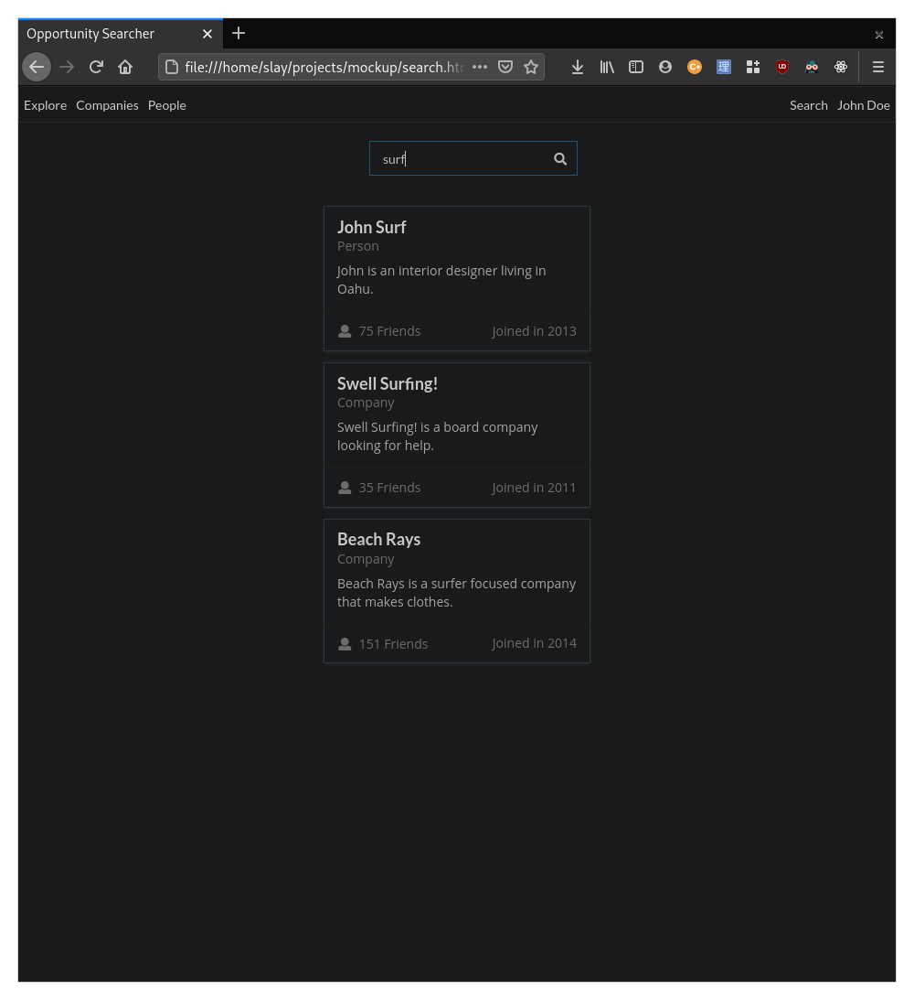
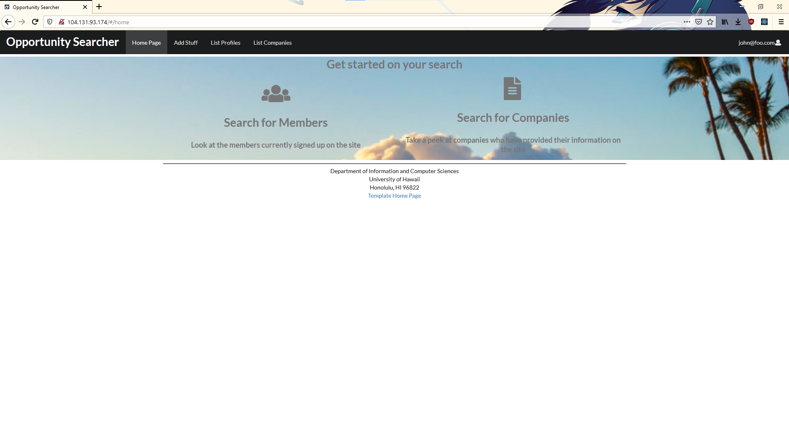
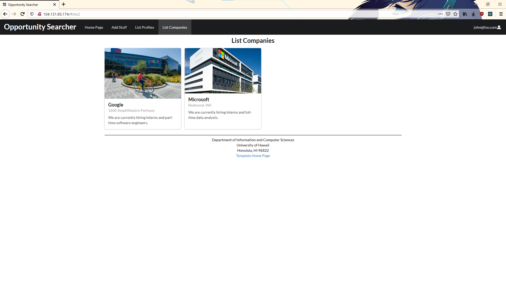

The basis of this project can be found [here](http://courses.ics.hawaii.edu/ics314s21/morea/final-project/reading-project-company-connector.html)

Repository for [source code](https://github.com/opportunity-searcher/opportunity-searcher)

## Table of Contents

* [The problem](#the-problem)
* [The solution](#the-solution)
* [Overview](#overview)
* [Goals](#goals)
* [Team Members](#team-members)
* [Deployment](#deployment)
* [Project Progress](#project-progress)
* [Developer Guide](#developer-guide)

## The problem

Many UH computer science and engineering students want to learn about internship and job opportunities, but currently they must wait until a company decides to visit the campus or send out some sort of announcement. There is no efficient way for students to understand the “landscape” of internship and job opportunities that might be available in the future, so they can prepare for them now.

## The solution

The web application provides a new way for local and non-local companies who want to recruit students from UH to make their (potential) opportunities known to students. At the same time, students can create profiles on the site with their interests. The site can match students to employers and vice-versa.

## Overview

Instead of sending out announcements each year, a company can create a page in the site that lists:

- A brief overview of the company.
- Geographic location of the company.
- A list of positions that they commonly recruit for from new UH graduates. Each position has a brief description, a set of skills, whether it’s an internship, permanent position, or both, how many people they would like to hire, and salary range.
- Links to pages for additional information.
- Contact email(s) for followup.

Students who visit the site can create a profile with their interests (skills), preferred geographic location, and link to their professional portfolio page.

## Goals

- Profile page for students and companies
- a way to search by various categories like skill, geographic preference, etc.
- messaging system
- quality UI

## Team Members

- [Matthew Ito](https://github.com/Matt-Ito): UH Manoa student majoring in ICS and minoring in Japanese. Hobbies include video games, anime, and weightlifting.
- [Kegan Flagg](https://github.com/keggit): UH Manoa student who enjoys running as a hobby.
- [Jay Paul Luben](https://github.com/jpluben): UH Manoa student majoring in Computer Science:Security Science with a hobby in Video Games and Anime.

## Deployment

The application can be found hosted on the Digital Ocean cloud servers [here](https://opportunity-searcher.xyz).\
The landing page will look like the screenshot below.


# Project Progress

* [Final Project: Milestone 1](https://github.com/orgs/opportunity-searcher/projects/1) (In progress)
* [Final Project: Milestone 2](https://github.com/orgs/opportunity-searcher/projects/2) (In progress)

The Milestones provide issues about the [application](https://opportunity-searcher.xyz) and [github homepage](https://opportunity-searcher.github.io/) being worked on.

The following sections contain the project's progression of the application in chronological order.

## Mockup Pages

### Home Page

The home page will contain the profile of students looking for work as well as the profiles of companies looking for students. Besides this, it will have a navbar that will show different links based on whether somone is using a student account, company account, or no account at all.


### Profile Page

There will be two different types of profile pages: student profiles and company profiles. Besides the basic information, student profiles contain the type of position they are searching for. Meanwhile, company profiles include information about what kinds of candidates they are looking for.


### Messaging Page

A Company will put down an email link of a company representative so that students can quickly email the company, students also have an email link so that companies can scout them.


### Search Page

Students and companies can both search using a unified search button. Results are in the form of profiles.


## Site changes

The following screenshots shows how it looks on the [website](https://opportunity-searcher.xyz)

### Home Page

Users upon login will be redirected to the home page, which will show options to look at member profiles and company profiles



### List Profiles

Logged in users will be able to look at student profiles in the database


### List Companies

Logged in users will be able to look at company profiles in the database


## Developer Guide

This section provides information of interest to Meteor developers wishing to use this code base as a basis for their own development tasks.

### Installation

First, [install Meteor](https://www.meteor.com/install).

Second, visit the [Opportuniter Searcher application github page](https://github.com/opportunity-searcher/opportunity-searcher), and click the "Use this template" button to create your own repository initialized with a copy of this application. Alternatively, you can download the sources as a zip file or make a fork of the repo.  However you do it, download a copy of the repo to your local computer.

Third, cd into the opportunity-searcher/app directory and install libraries with:

```
$ meteor npm install
```

Fourth, run the system with:

```
$ meteor npm run start
```

If all goes well, the application will appear at [http://localhost:3000](http://localhost:3000).

### Application Design

Opportunity Searcher is based upon [meteor-application-template-react](https://ics-software-engineering.github.io/meteor-application-template-react/) and [meteor-example-form-react](https://ics-software-engineering.github.io/meteor-example-form-react/). Please use the videos and documentation at those sites to better acquaint yourself with the basic application design and form processing in Bowfolios.

## Initialization

The [config](https://github.com/bowfolios/bowfolios/tree/master/config) directory is intended to hold settings files.  The repository contains one file: [config/settings.development.json](https://github.com/bowfolios/bowfolios/blob/master/config/settings.development.json).

This file contains default definitions for Profiles and Companies. Consult the walkthrough video for more details.

### Quality Assurance

#### ESLint

Opportunity Searcher includes a [.eslintrc](https://github.com/opportunity-searcher/opportunity-searcher/blob/master/app/.eslintrc) file to define the coding style adhered to in this application. You can invoke ESLint from the command line as follows:

```
meteor npm run lint
```

Here is sample output indicating that no ESLint errors were detected:

```
$ meteor npm run lint

> bowfolios@ lint /Users/philipjohnson/github/bowfolios/bowfolios/app
> eslint --quiet --ext .jsx --ext .js ./imports ./tests

$
```

ESLint should run without generating any errors [Note that at the time of writing, searchpage.jsx has not been fixed yet so an eslint error will pop up].

It's significantly easier to do development with ESLint integrated directly into your IDE (such as IntelliJ).
