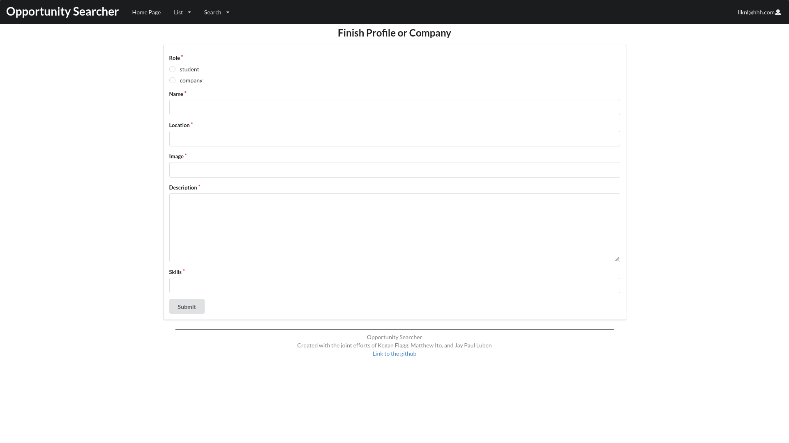
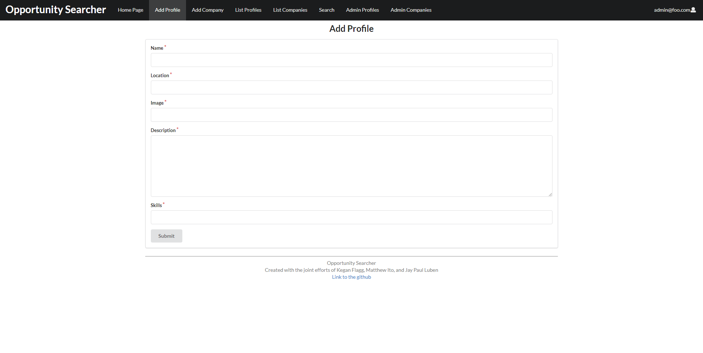

The basis of this project can be found [here](http://courses.ics.hawaii.edu/ics314s21/morea/final-project/reading-project-company-connector.html)

Repository for [source code](https://github.com/opportunity-searcher/opportunity-searcher)


## Table of Contents

* [The problem](#the-problem)
* [The solution](#the-solution)
* [Overview](#overview)
* [Goals](#goals)
* [Team Members](#team-members)
* [User Guide](#user-guide)
* [Deployment](#deployment)
* [Developer Guide](#developer-guide)
* [Project Progress](#project-progress)
* [User Reviews](#user-reviews)

## The problem

Many UH computer science and engineering students want to learn about internship and job opportunities, but currently they must wait until a company decides to visit the campus or send out some sort of announcement. There is no efficient way for students to understand the “landscape” of internship and job opportunities that might be available in the future, so they can prepare for them now.

## The solution

The web application provides a new way for local and non-local companies who want to recruit students from UH to make their (potential) opportunities known to students. At the same time, students can create profiles on the site with their interests. The site can match students to employers and vice-versa.

## Overview

Instead of sending out announcements each year, a company can create a page in the site that lists:

- A brief overview of the company.
- Geographic location of the company.
- A list of positions that they commonly recruit for from new UH graduates. Each position has a brief description, a set of skills, whether it’s an internship, permanent position, or both, how many people they would like to hire, and salary range.
- Links to pages for additional information.
- Contact email(s) for followup.

Students who visit the site can create a profile with their interests (skills), preferred geographic location, and link to their professional portfolio page.

## Goals

- Profile page for students and companies
- a way to search by various categories like skill, geographic preference, etc.
- messaging system
- quality UI

## Team Members

- [Matthew Ito](https://github.com/Matt-Ito): UH Manoa student majoring in ICS and minoring in Japanese. Hobbies include video games, anime, and weightlifting.
- [Kegan Flagg](https://github.com/keggit): UH Manoa student who enjoys running as a hobby.
- [Jay Paul Luben](https://github.com/jpluben): UH Manoa student majoring in Computer Science:Security Science with a hobby in Video Games and Anime.

## User Guide

This section provides information of interest to users who would like a step-by-step tutorial on how to use this application to its extent.

## Sign up

You will first have to sign up, the following screenshot will show you how the sing-up page looks.


## Finish Profile

After signing up, you are redirected to the finish sign up page. Here you can decide whether you are a company or a student looking for work and complete your profile based on the decision. If you do not finish the profile it is available to finish by clicking 'Finish Profile' in the login dropdown menu.


## List Profiles

After adding your new profile, you can then see your profile along with everyone elses!


## List Companies

Feel free to browse the catalogue of many different and unique companies looking for talented enthusiasts such as yourself to add to their ranks!


## Deployment

The application can be found hosted on the Digital Ocean cloud servers [here](https://opportunity-searcher.xyz/).\
The landing page will look like the screenshot below.


## Developer Guide

This section provides information of interest to Meteor developers wishing to use this code base as a basis for their own development tasks.

### Installation

First, [install Meteor](https://www.meteor.com/install).

Second, visit the [Opportunity Searcher application github page](https://github.com/opportunity-searcher/opportunity-searcher), and click the "Use this template" button to create your own repository initialized with a copy of this application. Alternatively, you can download the sources as a zip file or make a fork of the repo.  However you do it, download a copy of the repo to your local computer.

Third, cd into the opportunity-searcher/app directory and install libraries with:

```
$ meteor npm install
```

Fourth, run the system with:

```
$ meteor npm run start
```

If all goes well, the application will appear at [http://localhost:3000](http://localhost:3000).

### Application Design

Opportunity Searcher is based upon [meteor-application-template-react](https://ics-software-engineering.github.io/meteor-application-template-react/) and [meteor-example-form-react](https://ics-software-engineering.github.io/meteor-example-form-react/). Please use the videos and documentation at those sites to better acquaint yourself with the basic application design and form processing in Bowfolios.

## Initialization

The [config](https://github.com/bowfolios/bowfolios/tree/master/config) directory is intended to hold settings files.  The repository contains one file: [config/settings.development.json](https://github.com/bowfolios/bowfolios/blob/master/config/settings.development.json).

This file contains default definitions for Profiles and Companies. Consult the walkthrough video for more details.

### Quality Assurance

#### ESLint

Opportunity Searcher includes a [.eslintrc](https://github.com/opportunity-searcher/opportunity-searcher/blob/master/app/.eslintrc) file to define the coding style adhered to in this application. You can invoke ESLint from the command line as follows:

```
meteor npm run lint
```

Here is sample output indicating that no ESLint errors were detected:

```
$ meteor npm run lint

> bowfolios@ lint /Users/philipjohnson/github/bowfolios/bowfolios/app
> eslint --quiet --ext .jsx --ext .js ./imports ./tests

$
```

ESLint should run without generating any errors [Note that at the time of writing, searchpage.jsx has not been fixed yet so an eslint error will pop up].

It's significantly easier to do development with ESLint integrated directly into your IDE (such as IntelliJ).

#### End to End Testing

Opportunity Searcher uses [TestCafe](https://devexpress.github.io/testcafe/) to provide automated end-to-end testing.

The Opportunity Searcher end-to-end test code employs the page object model design pattern.  In the [Opportunity Searcher tests/ directory](https://github.com/opportunity-searcher/opportunity-searcher/tree/master/app/tests), the file [tests.testcafe.js](https://github.com/opportunity-searcher/opportunity-searcher/blob/master/app/tests/tests.testcafe.js) contains the TestCafe test definitions. The remaining files in the directory contain "page object models" for the various pages in the system (i.e. Home, Landing, Interests, etc.) as well as one component (navbar). This organization makes the test code shorter, easier to understand, and easier to debug.

To run the end-to-end tests in development mode, you must first start up a Opportunity Searcher instance by invoking `meteor npm run start` in one console window.

Then, in another console window, start up the end-to-end tests with:

```
meteor npm run testcafe
```

You will see browser windows appear and disappear as the tests run.  If the tests finish successfully, you should see the following in your second console window:

```
$ meteor npm run testcafe

> meteor-application-template-react@ testcafe C:\Users\jpaul\Documents\Github\opportunity-searcher\app
> testcafe chrome:headless tests/*.testcafe.js -q --app "meteor npm run start"

 Running tests in:
 - Chrome 90.0.4430.93 / Windows 10

 meteor-application-template-react localhost test with default db
 √ Test that landing page shows up (unstable)
 √ Test that signin and signout work
 √ Test the Search page
 √ Test the List Profiles page
 √ Test the List Companies page
 √ Test the home page
 √ Test the Add Profile page
 √ Test the Add Company page


 8 passed (50s)


 $
```

All the tests pass, but the first test is marked as "unstable". At the time of writing, TestCafe fails the first time it tries to run a test in this mode, but subsequent attempts run normally. To prevent the test run from failing due to this problem with TestCafe, we enable [testcafe quarantine mode](https://devexpress.github.io/testcafe/documentation/guides/basic-guides/run-tests.html#quarantine-mode).

The only impact of quarantine mode should be that the first test is marked as "unstable".

## Continuous Integration


Opportunity Searcher uses [GitHub Actions](https://docs.github.com/en/free-pro-team@latest/actions) to automatically run ESLint and TestCafe each time a commit is made to the default branch.  You can see the results of all recent "workflows" at [https://github.com/opportunity-searcher/opportunity-searcher/actions](https://github.com/opportunity-searcher/opportunity-searcher/actions).

The workflow definition file is quite simple and is located at
[.github/workflows/ci.yml](https://github.com/opportunity-searcher/opportunity-searcher/blob/master/.github/workflows/ci.yml).


# Project Progress

The Milestones provide issues about the [application](https://opportunity-searcher.xyz/) and [github homepage](https://opportunity-searcher.github.io/) being worked on.

## Milestone 1

* [Final Project: Milestone 1](https://github.com/orgs/opportunity-searcher/projects/1)

5 mockup pages are implemented and available to see on Digital Ocean.

## Mockup Pages

### Home Page

The home page will contain the profile of students looking for work as well as the profiles of companies looking for students. Besides this, it will have a navbar that will show different links based on whether somone is using a student account, company account, or no account at all.


### Profile Page

There will be two different types of profile pages: student profiles and company profiles. Besides the basic information, student profiles contain the type of position they are searching for. Meanwhile, company profiles include information about what kinds of candidates they are looking for.


### Messaging Page

A Company will put down an email link of a company representative so that students can quickly email the company, students also have an email link so that companies can scout them.


### Search Page

Students and companies can both search using a unified search button. Results are in the form of profiles.


## Webpages

### Home

The simple home page directs users to use the search function.


### List Companies and Profiles

This page shows a list of all the companies, and also has a similar page for students/regular users.


Here is the student page:


### Search

The search page is simple. It provides a searchbar for typing in keywords which display both companies and profiles in a unified format.


## Milestone 2
* [Final Project: Milestone 2](https://github.com/orgs/opportunity-searcher/projects/2)

### Add Profile

The add profile page lets all users create a profile of a student looking for an opportunity.



### Add Company

The add company page lets all users create a profile of a company looking for potential hires or candidates.


### List Profiles

When logged in as an administrator, the list profiles page includes an edit button for all profiles so that admins may edit any info included with the profile.


### List Companies

When logged in as an administrator, the list companies page includes an edit button for all companies so that admins may edit any info included with the company.


### Edit Profile

The edit profile page is only available to admins who have clicked on a specific profile to edit. This page allows admins to change information associated with the profile using a form


## Milestone 3
* [Final Project: Milestone 3](https://github.com/orgs/opportunity-searcher/projects/3)

### Personal Pages

Each profile or company now comes with a personal page upon clicking on a specific profile card.


### Homepage

The homepage has been updated to include two buttons to redirect users to a list page for profiles or companies. Also, a featured "Profile of the Day" and "Company of the Day" has been implemented as a spotlight for individuals to get our users noticed faster.


# User Reviews

## Anonymous Reviews from Testers

"Overall format easy to use and fill out. After the finishing of the profile, wish it automatically took me to the Companies or Other Profiles page. Very clear to use and worked well."

"website is pretty cool, great idea to serve for finding UH students jobs. Main issues were that it didn’t seem too compatible with iOS, I couldn’t upload a picture to the image box and instructions weren’t quite clear there. Also, homepage format for iOS made text boxes very narrow and hard to read. Other than that, cool concept."

"I think the website design is nice. However it is a bit messy on my phone and I cannot attach an image... Overall good job"

"The website you and the others created is very user-friendly in looking for new ways for non-local and local companies to recruit students for internships or jobs from the University of Hawaii"

"Making the account was very smooth going, straight forward and also quick to make!"
